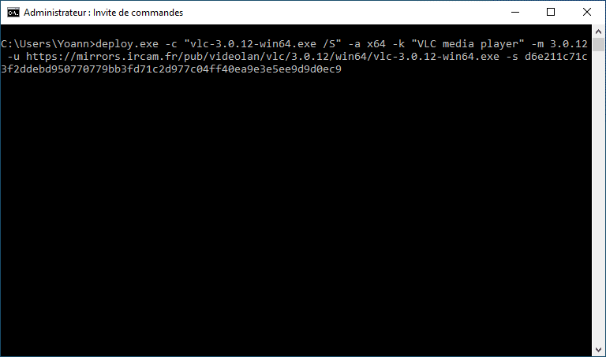
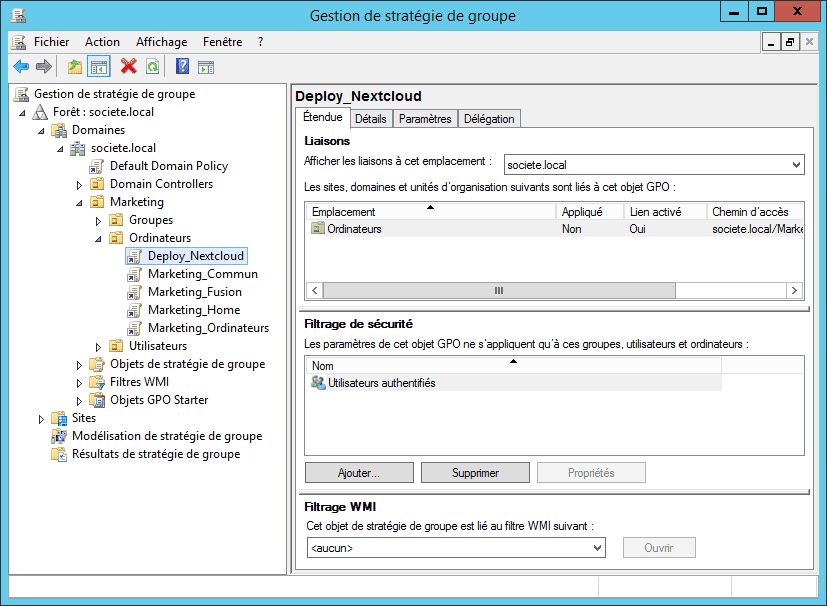

# deploy

Windows command-line utility to deploy applications locally and remotely using script or through Group Policy Objects (GPOs).

```
Usage: deploy.exe -c <commandline> [-a <architecture>] [-k <key>] [-m <version>] [-u <url>] [-s <sha256>]

-a <architecture>, --arch=<architecture> : Execute command line only on the specified target architecture : all, x86, x64 (default : all)
-c <commandline>, --cmdline=<commandline> : Command line to execute
-k <key>, --key=<key> : Application uninstall key
-m <version>, --min=<version> : Minimum application version
-u <url>, --url=<url> : URL to use to download the file or to fecth the file (supports zip file)
-s <sha256>, --sha=<sha256> : Secure Hash Algorithm (SHA-256) of downloaded file or fetched file
-h, --help : Print this help screen
-v, --version : Print the version of the program and exit
```

This program have been created by Yoann LAMY under the terms of the [GNU General Public License v3](http://www.gnu.org/licenses/gpl.html).



## Examples :

VLC installation :

```
deploy.exe -c "vlc-3.0.12-win64.exe /S" -a x64 -k "VLC media player" -m 3.0.12 -u https://mirrors.ircam.fr/pub/videolan/vlc/3.0.12/win64/vlc-3.0.12-win64.exe -s d6e211c71c3f2ddebd950770779bb3fd71c2d977c04ff40ea9e3e5ee9d9d0ec9
```

Firefox installation :

```
deploy.exe -c "msiexec /i 'Firefox Setup 86.0.1.msi' /qn /norestart" -a x64 -k "Mozilla Firefox 86.0.1 (x64 en-US)" -m 86.0.1 -u https://download-installer.cdn.mozilla.net/pub/firefox/releases/86.0.1/win64/en-US/Firefox%20Setup%2086.0.1.msi -s 4075c2a2d210ca635bad20b572659a6ec187a46def4e446bc77753e1d7e8c9e3
```

LibreOffice installation :

```
deploy.exe -c "msiexec /i LibreOffice_7.0.5_Win_x64.msi /qn /norestart CREATEDESKTOPLINK=0" -a x64 -k {726F4143-9BAA-4F54-A918-07C139D9C775} -m 7.0.5.2 -u https://miroir.univ-lorraine.fr/documentfoundation/libreoffice/stable/7.0.5/win/x86_64/LibreOffice_7.0.5_Win_x64.msi -s d5cc1613f56f54058b02701c8f7bea80ec20a452b2ba48099bd49350e2f05955
```

Adobe Acrobat Reader DC installation using script BAT in a zip file :

```
deploy.exe -c "install.bat" -a all -k {AC76BA86-7AD7-FFFF-7B44-AC0F074E4100} -m 21.001.20142 -u \\server\share\adobeacrobatreaderdc.zip -s 0b24eb9798846f8453749dfe15fdc4ec88a9592ec641b3c4e1476746a234c164
```

Nextcloud Desktop Client installation through Group Policy Objects (GPOs) in an Active Directory domain :

```
deploy.exe -c "Nextcloud-3.1.3-setup.exe /S" -a all -k Nextcloud -m 3.1.3 -u https://github.com/nextcloud/desktop/releases/download/v3.1.3/Nextcloud-3.1.3-setup.exe -s f2b1068a1e2add84eaa4b0bb57585079d2a703297b690af32509063ae54b9da0
```



CREDITS :
This program use the [HashLib4Pascal library](https://github.com/Xor-el/HashLib4Pascal).
